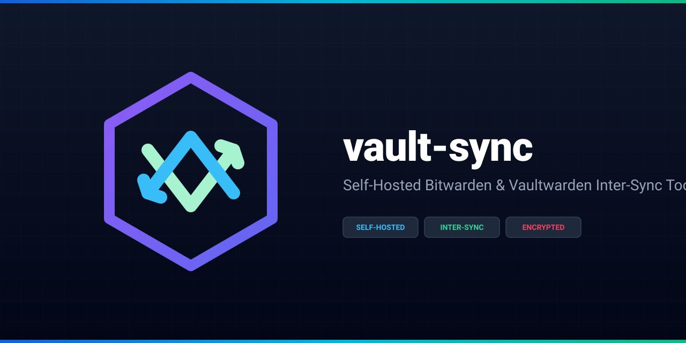

# vault-sync

<p align="center">
  
</p>

<p align="center">
  <a href="#license"></a>
  
  
</p>

A **single-container** service that keeps a second Bitwarden-compatible vault as an encrypted, incremental mirror of your primary [Vaultwarden](https://github.com/dani-garcia/vaultwarden) — or any two Bitwarden-API servers, either direction. Drop-in for unattended nightly backups; ships with a small web UI for credentials, scheduling, logs, and manual runs.

## Why

Self-hosted vaults deserve an off-host, encrypted, automatically-recovering copy. Cron-driven `bw export` → `bw import` works, but it pollutes the backup account with thousands of readable items on every run. vault-sync keeps a **persistent id map** between the two servers, so nightly runs apply only real diffs and finish in seconds. The container holds everything sensitive as AES-256-GCM ciphertext and runs headless-safe (API keys skip interactive 2FA / device-verification).

## Features

- **Incremental mirror** — semantic diff (source snapshot × target state × stored id map) and applies only `create` / `edit` / `delete`. Typical nightly run of a ~1000-item vault: **< 1 minute**.
- **Archive mode** — daily Bitwarden `encrypted_json` export, sealed with a separate file password, day-based retention, restorable anywhere: `bw import bitwardenjson FILE --passwordenv FILEPW`.
- **Web UI** — status, logs, run-now, schedule (daily / every-N-hours / manual), direction & method switch, masked credential editor with per-peer live connection test, optional TOTP 2FA for the UI itself.
- **Encrypted config** — all credentials live in `config.enc` (AES-256-GCM, scrypt-derived). The encryption key is auto-generated on first boot inside the data volume; optionally mount `/run/secrets/key:ro` to keep it on separate media.
- **Self-healing mapping** — items match by stored id first, then by stable-sorted unique-name adoption. Flipping the direction automatically **inverts** the existing map, no re-adoption needed.
- **Hardware / LAN-only** — plain HTTP, no external dependencies, no cloud. Designed for a NAS reachable only on your home network.

## Quick start

```bash
git clone https://github.com/hug0-l/vault-sync
cd vault-sync
docker build -t vault-sync .
docker run -d --name vault-sync --restart unless-stopped \
  -p 127.0.0.1:8770:8770 \
  -v /srv/vault-sync:/data \
  vault-sync
```

Open <http://127.0.0.1:8770>, complete the setup wizard (admin password + two peers), press **Test** on each peer, then **Run now**. The internal scheduler handles the rest — no host crontab required.

Each peer needs: server URL, an **API key** (Vaultwarden: *Account → Security → API Key*; Bitwarden.com: *Account → API Key*, may require enabling 2FA first), and the master password.

> ⚠️ Plain HTTP + holds the keys to your vaults. Bind to a trusted interface (as above), **do not** put it behind a public reverse proxy, and enable the built-in TOTP 2FA.

## How it works

```
┌─ vault-sync (single container) ────────────────────────────────────────┐
│                                                                       │
│  ┌─ engine/run.mjs (per cycle) ──────────────────────────────────┐   │
│  │  source: bw export --format json     → /dev/shm (RAM only)  │   │
│  │  target: bw sync + bw list items/folders                     │   │
│  │  plan:   semantic diff vs. mapping.json bucket             │   │
│  │  apply:  bw create / edit / delete  (concurrent, 2x)      │   │
│  │  write:  mapping.json + state.json                         │   │
│  │  archive: encrypted_json export (separate file password)  │   │
│  └─────────────────────────────────────────────────────────────┘   │
│                                                                       │
│  ┌─ crypto.mjs ─┐  config.enc: AES-256-GCM, scrypt-derived key      │
│  │  scrypt +    │  key auto-generated at /data/.vault-sync.key     │
│  │  AES-256-GCM │  (or mount /run/secrets/key for extra hardening) │
│  └─────────────┘                                                     │
└───────────────────────────────────────────────────────────────────────┘
```

`mapping.json` (in `/data/backups/`) stores `{direction: {source_id → target_id}}`. Each run:

1. **Source snapshot** via `bw export --format json` (tmpfs only) + encrypted archive written
2. **Target state** via one `bw sync` + `bw list items/folders`
3. **Diff** under normalization — volatile fields (`id`, `key`, `object`, `revisionDate`, `reprompt`, empty optionals, …) are stripped from *both* sides, so a steady-state vault produces a zero-op plan
4. **Apply** — `create` / `edit` / `delete` at concurrency 2 with backoff; mapping checkpointed every 25 ops

**Direction semantics** — this is a *one-way* mirror: `B>A` makes the source side's content overwrite the target. It is **not** two-way merge (that's on the roadmap; the data model already stores both peers symmetrically). Target items unknown to the mapping are **left alone** (never deleted) as a safety policy.

## Configuration

All runtime config is set via the **web UI** and encrypted at rest. Container env vars (all optional):

| Var | Default | Meaning |
|---|---|---|
| `PORT` | `8770` | Listen port |
| `DATA_DIR` | `/data` | State directory (`config.enc`, `sync.log`, `backups/`) |
| `KEY_FILE` | `/run/secrets/key` | Encryption key mount path; if absent, a random key is generated inside `$DATA_DIR/.vault-sync.key` |
| `TZ` | (host) | Scheduler timezone — set this explicitly (e.g. `TZ=Asia/Hong_Kong`) for deterministic run timing |

## Debugging

- `DRY_RUN=1` — every run computes and logs the plan, applies nothing
- `DEBUG_DIFF=1` — reserved for field-level diff tracing
- logs: `/data/sync.log` (also in the UI), state: `/data/state.json`
- container logs: `docker logs vault-sync`

## Project layout

```
server.mjs         API + scheduler
auth.mjs           bcrypt login, TOTP (otplib), rate limit, sessions
crypto.mjs         config.enc envelope (scrypt + AES-256-GCM)
engine/bw.mjs      hardened @bitwarden/cli wrapper (positional base64 args, redacted errors)
engine/plan.mjs    pure diff / normalization / adoption
engine/apply.mjs   concurrent job runner with checkpointing
engine/run.mjs     cycle orchestration, mapping buckets, direction inversion, retention
public/index.html  single-page UI (no framework)
Dockerfile         node:20-alpine + @bitwarden/cli@latest
```

## License

[MIT](./LICENSE)
